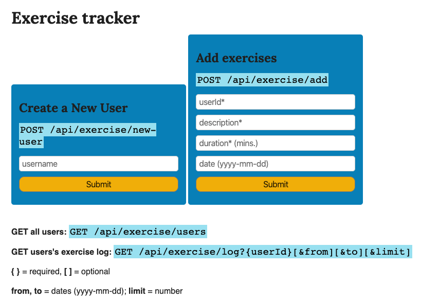

# Exercise Tracker REST API Project

A full-stack JavaScript web development project. I wrote a blog post about the project, where you can read about programming concepts I used and about app's features and functionality. You can find it on my [medium profile](https://medium.com/@marko.libor/exercise-tracker-b4f9303e0673).

## Technologies used
* Node.JS
* Express
* MongoDB
* Mongoose
* REST API
* JSON
* React.JS
* JavaScript 
* HTML5
* CSS3

## User Stories

1. I can create a user by posting form data username to /api/exercise/new-user and returned will be an object with username and _id.
2. I can get an array of all users by getting api/exercise/users with the same info as when creating a user.
3. I can add an exercise to any user by posting form data userId(_id), description, duration, and optionally date to /api/exercise/add. If no date supplied it will use current date. Returned will be the user object with also with the exercise fields added.
4. I can retrieve a full exercise log of any user by getting /api/exercise/log with a parameter of userId(_id). Return will be the user object with added array log and count (total exercise count).
5. I can retrieve part of the log of any user by also passing along optional parameters of from & to or limit. (Date format yyyy-mm-dd, limit = int)

## Setup and Run

Try the app [here](https://exercise-tracker-lm.glitch.me/).

## Screenshot of the App
